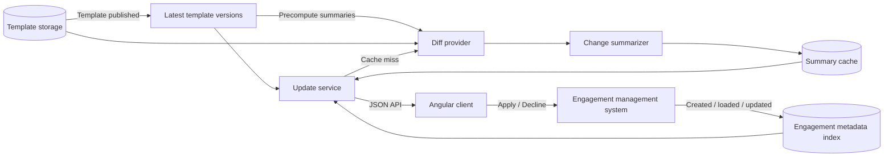

# Freshprint - Architecture and Design

## Objective

Freshprint shows accounting firms which engagement files were created from an older product-template version. It gives users a readable summary of what changed and lets them choose Apply or Decline.

A template is a reusable JSON blueprint containing questions, procedures, checklists, guidance, and rules. An engagement is a customer's working file created from one version of that template. Publishing a new template does not automatically change existing engagements.

The main constraint is that loading one engagement takes about one minute, and loading it is currently required to read its template ID and version. The update list therefore cannot open every engagement. Applying the new template content is outside this exercise.

## 1. High-Level Architecture



### Components and Data Flow

The existing **engagement management system** stores and loads complete engagement files and handles Apply or Decline. When an engagement is created, loaded, or successfully updated, a hook sends its ID, name, template ID, and template version to a small **metadata index**.

The index is the key response to the one-minute constraint. The update list reads these small records instead of loading complete engagements. New engagements are indexed when created. Older engagements can be indexed in the background or the next time they are normally opened. An engagement that has not been indexed is shown as `UNKNOWN`, not incorrectly reported as current.

When a template is published, the template system records its latest version. The **update service** compares each indexed engagement version with that latest version:

- Same version: `CURRENT`
- Older version: `PENDING`
- Missing engagement metadata: `UNKNOWN`

If several versions have accumulated, the service compares the engagement's recorded version directly with the latest version. For example, if a value changed from 5% to 4.5% and later to 4%, the user sees the effective change from 5% to 4%, not two intermediate changes.

The raw JSON diff is converted into a readable, structured summary in the **Java backend**. This is a business rule, so keeping it on the server gives every client the same wording, hides internal JSON paths, and makes the result easier to test. The transformation is deterministic. If a path is not recognized, the change is still shown with a general description instead of being silently dropped.

Summaries use a **precompute plus on-demand fallback**. When a template is published, the system precomputes summaries for the distinct older baseline versions currently in use. Each result is stored by template ID, baseline version, target version, and summary-rule version. Requests reuse that result instead of processing the same diff again. If a baseline was not known during precomputation, the summary is generated and stored on demand; the API can return `COMPUTING` until it is ready. The cache contains derived template data, not customer engagement content, and can be rebuilt from the source templates.

The **Angular client** displays the status and server-generated summary, manages the selected engagement and button state, and initiates Apply or Decline. It does not compare versions or interpret raw diffs.

### Client / Server Contract

The real system would use the following JSON contract. For this exercise, Java and Angular are separate excerpts: Java contains the domain logic, while Angular uses hardcoded data shaped like this response.

`GET /api/engagements/template-updates`

```json
{
  "items": [
    {
      "engagementId": "ENG-1003",
      "name": "Harbourview Logistics 2026",
      "template": {
        "id": "AUDIT-CA",
        "displayName": "Canadian Audit Engagement"
      },
      "status": "PENDING",
      "baselineVersion": 3,
      "targetVersion": 5,
      "pendingVersionCount": 2,
      "summary": {
        "state": "AVAILABLE",
        "generatedAt": "2026-08-18T13:04:41Z",
        "groups": [
          {
            "section": "Materiality",
            "changes": [
              {
                "kind": "CHANGED",
                "description": "Materiality threshold changed from 5% to 4%.",
                "reviewRecommended": false
              }
            ]
          }
        ]
      },
      "freshness": {
        "state": "FRESH",
        "checkedAt": "2026-08-18T13:05:00Z"
      }
    }
  ]
}
```

`summary.state` is `AVAILABLE`, `COMPUTING`, or `UNAVAILABLE`. When it is not available, the response omits `groups` and includes a reason. `freshness.state` is `FRESH` or `STALE`, with the last check time. These explicit states avoid using `null` for several different meanings.

`POST /api/engagements/ENG-1003/template-update-decisions`

```json
{
  "decision": "APPLY",
  "expectedBaselineVersion": 3,
  "targetVersion": 5
}
```

```json
{
  "operationId": "OP-7241",
  "status": "ACCEPTED"
}
```

The versions confirm exactly what the user reviewed. If a newer version appears before the decision is processed, the server returns `409 Conflict` and asks the client to refresh. Apply may be asynchronous because loading the engagement is slow. `ACCEPTED` means the operation started, not that the template content was already merged.

### Future Contract Implementation

The examples above are the intended wire contract, not Java domain objects serialized directly. A future API adapter would build each response item from the engagement metadata index, `EngagementUpdateEvaluator`, template metadata, and `PendingUpdateSummaryService`. The index supplies `freshness.checkedAt` and whether it is `FRESH` or `STALE`; the evaluator does not know about freshness. The summary service supplies the readable groups, not raw JSON paths for Angular to interpret.

For a pending engagement, `summary` is always present. It has one of three shapes: `AVAILABLE` with `generatedAt` and readable `groups`, `COMPUTING` with `reason`, or `UNAVAILABLE` with `reason`. For example:

```json
{ "state": "COMPUTING", "reason": "SUMMARY_IN_PROGRESS" }
```

```json
{ "state": "UNAVAILABLE", "reason": "TEMPLATE_DIFF_UNAVAILABLE" }
```

`generatedAt` and `groups` belong only to `AVAILABLE`, as shown in the main GET example. `reason` is required for `COMPUTING` and `UNAVAILABLE`; `reviewRecommended` is a boolean on every change. `CURRENT` has no pending summary. An `UNKNOWN` item has no pending summary and includes a `statusReason` such as `TEMPLATE_METADATA_UNAVAILABLE`. `targetVersion` and `pendingVersionCount` can be zero for `UNKNOWN`; Angular must not treat zero as a real template version. These are the field rules I would make exact in a JSON Schema or OpenAPI definition before wiring the two excerpts together. The current Angular model would then make `COMPUTING.reason` and `reviewRecommended` required and add `statusReason`.

Angular would read this response through a future HTTP gateway instead of its hardcoded fixture. For a decision, it would send the selected engagement ID in the URL and the reviewed `decision`, `expectedBaselineVersion`, and `targetVersion` in the body. The server would re-check those versions before returning `ACCEPTED`. If either reviewed version is stale, the response is `409 Conflict`:

```json
{ "code": "VERSION_CONFLICT", "currentBaselineVersion": 3, "currentTargetVersion": 6 }
```

Angular would refresh the item and require a new review; it would not retry the old request blindly. Neither excerpt implements this HTTP adapter or the actual template merge, as requested by the exercise.

## 2. Implementation Plan

1. Create a plain Java module with the engagement, template, diff, summary, and pending-state models. Add interfaces for finding the latest template and comparing two versions.
2. Implement the pending-update evaluator and backend change summarizer. Add two or three focused JUnit tests. Do not add Spring, controllers, persistence, or a runnable server.
3. Create an Angular application with contract-matching models, hardcoded fixtures, a small state service, an engagement list, a summary view, and Apply/Decline actions. Do not make HTTP calls.
4. In a production implementation, add the metadata index, hooks, API, background indexing, and publication-triggered summary precomputation. Use on-demand generation for cache misses. The Angular fixture service could then be replaced with an HTTP service.

## 3. Testing Strategy

The Java tests will cover an engagement that is current, an engagement several versions behind, and conversion of known and unknown diff paths into readable summaries. The Angular tests will check that statuses and summaries render correctly and that Apply sends the reviewed baseline and target versions without allowing duplicate clicks.

In production, I would also test delayed or duplicate events, firm data isolation, a new template published while a user is reviewing, and recovery when indexed metadata becomes stale.

## 4. Evaluation and Observability

The main success measure is how quickly a published template update appears in the engagement list without loading engagement files. I would track:

- List request latency and errors
- Time from template publication to visible pending status
- Number and age of `UNKNOWN` or stale engagement records
- Summary generation time, failures, and cache hit rate
- Apply/Decline successes, failures, and version conflicts

Logs should include organization, engagement, template, baseline, target, operation, and correlation IDs, but not customer answers or complete engagement content. An audit record should capture who reviewed which versions, the decision, its time, and its result.

## 5. Failure Modes and Tradeoffs

- **Engagement metadata is missing:** return `UNKNOWN` and index it in the background or during a normal load. The list stays fast but may temporarily be incomplete.
- **A hook is delayed or missed:** use idempotent handlers and a periodic background check to repair stale metadata. This accepts short-lived eventual consistency.
- **A summary is not ready or fails:** keep the engagement `PENDING` and return `COMPUTING` or `UNAVAILABLE`. A summary problem must not hide the update itself.
- **A summary was not precomputed:** generate and store it on demand. This keeps publication work bounded while supporting older or newly indexed baselines.
- **A new version appears during review:** validate the baseline and target in the decision request and require a refresh when they are stale.
- **Several versions accumulated:** prefer one direct baseline-to-latest diff because consecutive changes may overwrite each other.
- **Apply is slow or fails:** represent it as an asynchronous operation. The actual merge, default values, draft migration, and rollback are outside this exercise.
- **Backend summary:** this requires server-side mapping rules, but it avoids duplicating business interpretation in Angular and other future clients.

## Assumptions

- Template versions increase in order within a template.
- A direct JSON diff can be generated between any two versions of the same template.
- Template publication and engagement actions can trigger hooks.
- The engagement system remains the source of truth; the metadata index is only a fast copy of the fields needed for this feature.
- The targeted implementation assumes no previous Apply/Decline history and uses the engagement's recorded template version as its baseline.
- Applying template content, authentication, filtering, search, bulk actions, and styling are outside scope.
