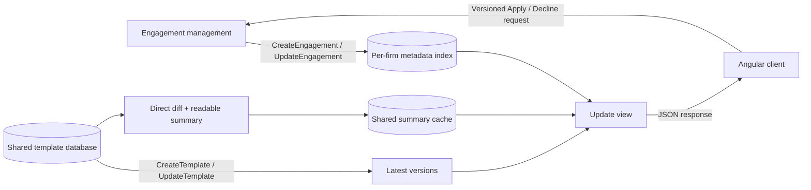

# Freshprint - Design

## The problem

An engagement is a firm's working file created from a product template. The template may change during the year, but an existing engagement does not change automatically. Users need a fast list of engagements with pending updates and a plain-language summary before choosing Apply or Decline. Several template versions may pile up before they decide. Actually merging new template content is outside this exercise.

The hard constraint is that opening one full engagement takes about a minute, and opening it is currently needed to read its template ID and version. We cannot open hundreds of files to build each list. Product templates, by contrast, are shared across firms and can be retrieved and compared quickly.

## 1. High-Level Architecture



Engagement management stays the source of truth. `CreateEngagement` and `UpdateEngagement` copy ID, name, template ID, and recorded version into a **firm-scoped index**. Lists read the index, not full files. Older files can be indexed in the background or during a normal load; until then they are `UNKNOWN`, never falsely `CURRENT`.

`CreateTemplate` initializes latest-version metadata; `UpdateTemplate` advances it and triggers summary precomputation. Java compares each engagement baseline with the latest version, counts actual newer versions, and asks for **one baseline-to-latest diff**. That shows the final effect rather than overwritten intermediate changes. Template lookup is fast; opening an engagement is the one-minute operation.

Java turns raw JSON diffs into grouped, readable changes so every client gets the same interpretation. Angular only displays them. Unknown paths stay visible with a review flag; the current Java fallback may show a raw path, which needs better wording before production.

Summaries are **precomputed plus generated on demand**. Updates arrive about once a week per product, so publication can build summaries for older baselines in use. The cache key is template ID, baseline, target, and summary-rule version. A new baseline is computed on a cache miss. The API can say `COMPUTING` while it runs or `UNAVAILABLE` if it fails, without hiding `PENDING`. The cache contains template-derived data, not customer answers.

Angular owns selection, display, and buttons. A real server validates versions and starts Apply/Decline asynchronously: the UI gets a quick receipt, not a final result. The take-home excerpts have no HTTP connection.

### JSON client/server contract

`GET /api/engagements/template-updates` returns a list. This shortened example shows the important fields:

```json
{
  "items": [
    {
      "engagementId": "ENG-1007",
      "name": "Bluewater Hospitality 2026",
      "template": {
        "id": "REVIEW-CA",
        "displayName": "Canadian Review Engagement"
      },
      "status": "PENDING",
      "baselineVersion": 6,
      "targetVersion": 8,
      "pendingVersionCount": 2,
      "summary": {
        "state": "AVAILABLE",
        "generatedAt": "2026-08-25T13:04:55Z",
        "groups": [
          {
            "section": "Analytics",
            "changes": [
              {
                "kind": "CHANGED",
                "description": "Tolerance changed from 0.15 to 0.1.",
                "reviewRecommended": false
              }
            ]
          }
        ]
      },
      "freshness": { "state": "FRESH", "checkedAt": "2026-08-25T13:05:00Z" }
    }
  ]
}
```

`summary` for a pending item is one of `AVAILABLE` (with time and groups), `COMPUTING` (with a reason), or `UNAVAILABLE` (with a reason). The two latter shapes are:

```json
{ "state": "COMPUTING", "reason": "SUMMARY_IN_PROGRESS" }
```

```json
{ "state": "UNAVAILABLE", "reason": "TEMPLATE_DIFF_UNAVAILABLE" }
```

`CURRENT` has no pending summary. `UNKNOWN` has a `statusReason`; the Java excerpt can return it when template metadata is missing or inconsistent. A truly unindexed file would also lack template/version fields, so a production schema should allow those fields to be absent for that `UNKNOWN` case. The Angular fixture demonstrates the simpler known-ID case, not full backfill behavior. `FRESH` or `STALE` plus `checkedAt` tells the client how recently the indexed metadata was checked; the index/API layer supplies this, not the Java evaluator. Technical reason codes stay in the contract while the UI uses plain-language messages.

`POST /api/engagements/{engagementId}/template-update-decisions` sends the exact versions the user reviewed:

```json
{ "decision": "APPLY", "expectedBaselineVersion": 6, "targetVersion": 8 }
```

`DECLINE` uses the same body shape. Either action returns a quick `{ "operationId": "OP-7241", "status": "ACCEPTED" }` receipt while processing continues asynchronously; this does **not** mean the decision is complete or the template was already merged. If the recorded baseline or latest target changed during review, the server returns `409 Conflict`:

```json
{
  "code": "VERSION_CONFLICT",
  "currentBaselineVersion": 6,
  "currentTargetVersion": 9
}
```

Angular then refreshes and asks for a new review rather than replaying the old decision. Before building HTTP adapters, I would put these conditional field rules in JSON Schema or OpenAPI and test both sides against it. The current Java records are domain results, not serialized API DTOs; the Angular types and fixture follow the proposed response for the excerpt.

A real app could later read `GET /api/template-update-operations/{operationId}` to learn whether an accepted decision is `RUNNING`, `SUCCEEDED`, or `FAILED`. The take-home Angular excerpt stops at the quick `ACCEPTED` receipt and does not wait for completion.

## 2. Implementation Plan

For the exercise: plain Java update and summary logic with three tests; an Angular list, review view, decision state, hardcoded fixture, and two tests. No HTTP, persistence, CSS, or template merge.

For production: connect the four hooks to durable handlers, backfill old files off the list path, precompute/cache summaries, add the JSON API, and replace Angular's fixture gateway with HTTP. Engagement management records the eventual decision outcome.

## 3. Testing Strategy

Java tests cover update states, accumulated versions, direct diffs, and readable or unavailable summaries. Angular tests cover display, disabled decisions without a ready summary, versioned Apply/Decline requests, and duplicate clicks.

Production tests would cover hook retries, backfill, firm isolation, cache misses, stale decisions, and failed async operations. A list test must prove it never opens full engagements.

## 4. Evaluation and Observability

I would track list latency, publish-to-visible-update time, `UNKNOWN`/`STALE` age, summary cache hits/failures, and decision outcomes/conflicts. Audit records need reviewer, baseline, target, choice, time, and outcome. Logs need IDs and versions, never customer answers or full file content.

## 5. Failure Modes and Tradeoffs

These are proposed production responses; the take-home excerpts implement the core states but not the event system or HTTP calls.

| What can happen, and why | Backend response | Frontend response / tradeoff |
| --- | --- | --- |
| A hook is delayed, duplicated, or lost during event delivery. | Retry, deduplicate, and reconcile; index may be `STALE`/`UNKNOWN` meanwhile. | Show uncertainty, not `CURRENT`. Fast lists trade immediate consistency for speed. |
| An old file predates the hooks, so its version is not indexed. | Backfill off the list path; never open a one-minute file during a request. | Show `UNKNOWN` until indexed. First-time completeness takes longer. |
| A publish event beats summary precomputation, or diffing fails. | Keep `PENDING`; return `COMPUTING` or `UNAVAILABLE`. | Show that state and disable actions under this demo's safety rule. The update remains visible. |
| A diff has wrong versions or an unfamiliar JSON path. | Reject mismatches; keep unknown paths with `reviewRecommended`. | Show unavailable/review wording. Traceability beats a polished but incorrect summary. |
| Template or engagement versions change during review. | Recheck versions; return `409 Conflict`. | Refresh and re-review. Extra work prevents stale decisions. |
| Apply/Decline fails after `ACCEPTED` because processing runs later. | Track final outcome; update the index only after successful Apply. | A future UI shows pending/failure, not false completion. Fast receipts defer final certainty. |

For several accumulated versions, the backend uses one baseline-to-latest diff. This shows the effective final change, not every intermediate edit; a separate history view could show the chronology. The targeted Java code assumes no earlier decisions. A production decision record would also avoid presenting an already-declined version as a new choice until another update arrives.

## Assumptions

- The recorded engagement version is the baseline; targeted Java has no decision history. Published version numbers increase but may skip values.
- The template system can quickly compare any two versions of the same template and produce a direct JSON diff.
- Four durable hooks exist: `CreateTemplate` initializes template metadata; `UpdateTemplate` publishes a version and precomputes summaries; `CreateEngagement` indexes the initial template/version; `UpdateEngagement` refreshes it after successful Apply. Handlers retry, deduplicate, and reconcile missed events.
- The one-minute limit is for loading **engagements**, not templates. Lists use cached engagement metadata; summaries use cached or newly generated template data.
- Engagement IDs/names can be listed without a full load. Old files are indexed in the background or during normal loads; until then they show `UNKNOWN`.
- Full files stay in customer-specific storage. The firm-scoped index is a copy; shared template data/caches hold no customer answers.
- Apply/Decline return a quick `ACCEPTED` receipt and finish asynchronously. The UI does not wait for completion; indexed metadata changes only after successful Apply.
- Java and Angular are separate, no-HTTP excerpts. Requiring a ready summary before a decision is my Angular demo safety choice, not a prompt requirement.
