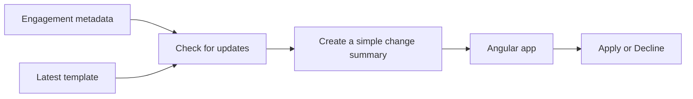

# Freshprint

Freshprint is a small app for finding files that are using an old template.

Think of it like this: you create a document from a template, the template changes later, and now you need to decide if you want those changes in your document. Freshprint shows you which files need attention and explains what changed without making you read a bunch of JSON.

This is still a work in progress.

## The main idea

Opening a full engagement file takes around one minute, so doing that for hundreds of files would be painfully slow.

Instead, Freshprint keeps a small copy of the useful details:

- The engagement ID and name
- The template it uses
- The template version it currently has

It compares that version with the latest template and gives the engagement one of these statuses:

- `CURRENT` - nothing to do
- `PENDING` - there is a newer template
- `UNKNOWN` - we do not have enough information yet

If an engagement missed a few template versions, we compare its current version directly with the latest one. The user only sees the changes that actually matter now.

## How it fits together



The backend turns the raw template diff into a simple summary. Those summaries can be created ahead of time and cached. If one is missing, it can be created when it is requested.

## What's in here?

```text
freshprint/
├── backend/       Java code and tests
├── fixtures/      Sample JSON data
├── DESIGN.md      The full system design
└── SUBMISSION.md  Notes about decisions and AI usage
```

The Java code is grouped by what it does:

```text
domain/
├── engagement/   Engagement versions and update statuses
├── template/     Templates and raw changes
└── summary/      Changes written for humans

application/
├── port/      Interfaces for getting template data
├── update/    Checks engagement versions
└── summary/   Builds readable summaries
```

## Run the tests

You need Java 26. Maven is already included in the project.

```shell
cd backend
./mvnw clean test
```

## Take-home checklist

The exercise asks for a small design and two code excerpts, not a running service.

### Part 1 - design

- [x] Short design covering architecture and the client/server boundary
- [x] Implementation plan and testing strategy
- [x] Evaluation, observability, failures, and tradeoffs
- [x] JSON API contract with request/response shapes, freshness, and unavailable or computing summaries
- [x] Explain why raw diffs become readable summaries in Java
- [x] Architecture diagram

These are in [DESIGN.md](DESIGN.md). The metadata index, hooks, summary cache, and HTTP API are production ideas in the design; they are not implemented here.

### Part 2 - Java

- [x] Plain Java domain models and interfaces, with no framework or HTTP layer
- [x] Evaluate `CURRENT`, `PENDING`, and `UNKNOWN` from the engagement's recorded template version
- [x] Count actual published versions when several updates have accumulated
- [x] Request one direct baseline-to-latest template diff and verify its versions
- [x] Turn raw diff changes into readable, grouped summaries on the server
- [x] Represent available, computing, and unavailable summary states
- [x] Three focused fixture-backed tests

The fixture provider selects a JSON diff by template and version pair. A missing direct fixture returns an unavailable summary; in the proposed production system, the diff would be generated from stored template versions.

### Part 3 - Angular

- [ ] Contract-shaped fixture data and client-side state
- [ ] Engagement list showing pending-update states
- [ ] Readable summary review
- [ ] Apply or Decline action using the reviewed baseline and target versions
- [ ] One or two focused tests if they demonstrate an important interaction

This excerpt should use hardcoded data, no HTTP calls, and unstyled markup. Actually merging updated template content is outside the exercise.

### Before submission

- [x] Submission notes for assumptions and AI usage
- [ ] Add the finished Angular work to the submission notes
- [ ] Record approximate time spent and review the "what I would do next" section
- [ ] Check that the design, JSON contract, Java, and Angular examples agree
- [ ] Be ready to explain and defend the code and AI-assisted decisions

Want the more detailed version? Take a look at [DESIGN.md](DESIGN.md).
