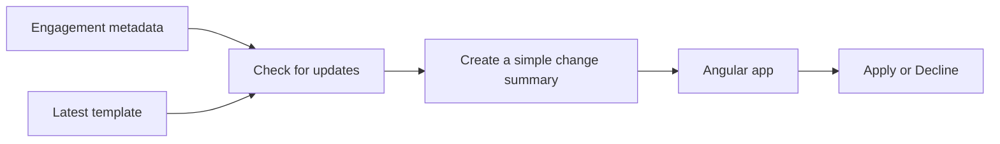

# Freshprint

Freshprint is a small app for finding files that are using an old template.

Think of it like this: you create a document from a template, the template changes later, and now you need to decide if you want those changes in your document. Freshprint shows you which files need attention and explains what changed without making you read a bunch of JSON.

This is still a work in progress.

## The main idea

Opening a full engagement file takes around one minute, so doing that for hundreds of files would be painfully slow.

Instead, Freshprint keeps a small copy of the useful details:

- The engagement ID and name
- The template it uses
- The template version it currently has

It compares that version with the latest template and gives the engagement one of these statuses:

- `CURRENT` - nothing to do
- `PENDING` - there is a newer template
- `UNKNOWN` - we do not have enough information yet

If an engagement missed a few template versions, we compare its current version directly with the latest one. The user only sees the changes that actually matter now.

## How it fits together



The backend turns the raw template diff into a simple summary. Those summaries can be created ahead of time and cached. If one is missing, it can be created when it is requested.

## What's in here?

```text
freshprint/
├── backend/       Java code and tests
├── fixtures/      Sample JSON data
├── DESIGN.md      The full system design
└── SUBMISSION.md  Notes about decisions and AI usage
```

The Java code is grouped by what it does:

```text
domain/
├── engagement/   Engagement versions and update statuses
├── template/     Templates and raw changes
└── summary/      Changes written for humans

application/port/ Interfaces for getting template data
```

## Run the tests

You need Java 26. Maven is already included in the project.

```shell
cd backend
./mvnw clean test
```

## Where are we now?

Done so far:

- The system design and JSON contract
- Sample data
- The Java project
- The main domain models
- The service that checks for pending updates
- The strategies that turn raw changes into simple summaries
- A few focused tests

Still to come:

- The Angular screen and state
- Apply and Decline actions in the Angular example

This project does not actually merge a new template into an engagement. That part is outside the scope of the exercise.

Want the more detailed version? Take a look at [DESIGN.md](DESIGN.md).
